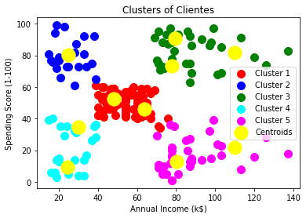

# crm
## Customer Segmentation Using K Means Clustering (data from CRM)

### Model Interpretation
1. Cluster 1 (Red Color) -> earning high but spending less
2. cluster 2 (Blue Colr) -> average in terms of earning and spending
3. cluster 3 (Green Color) -> earning high and also spending high [Objetive set "target"]
4. cluster 4 (cyan Color) -> earning less but spending more
5. Cluster 5 (magenta Color) -> Earning less , spending less
 
      

     
